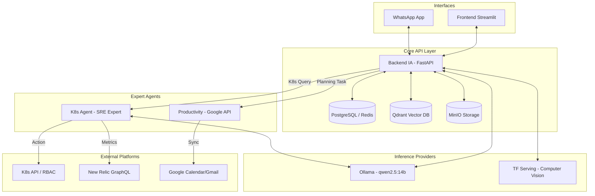

# Amael IA 🧠🤖

> **Amael IA** es una plataforma avanzada de Inteligencia Artificial Autónoma y Multi-Agente enfocada en la asistencia conversacional y la administración automatizada de infraestructuras (DevOps).

Desplegada completamente sobre Kubernetes, Amael IA no solo responde a preguntas generales integrando capacidades **RAG (Retrieval-Augmented Generation)** aisladas por usuario, sino que actúa activamente sobre tu entorno, organizando tareas y administrando clústeres reales con herramientas expertas.

---

## ✨ Características Principales

*   💬 **Interfaz Conversacional:** Acceso mediante un frontend web moderno en **Streamlit** y conectividad nativa vía **WhatsApp** (`whatsapp-bridge`), manteniendo los historiales y límites de consumo **aislados estrictamente por número de teléfono (`user_id`)**.
*   🔒 **Autenticación y Seguridad Estricta:** Soporte para **Google OAuth**, encriptado con JWT. Además, cuenta con un sistema de **Listas Blancas (Whitelists)**, separando a los usuarios regulares de los administradores de infraestructura.
*   🧠 **RAG Multiusuario:** Ingesta de PDFs y TXTs con vectorización en **ChromaDB**. Cada usuario tiene su propio espacio de memoria y contexto aislado en un volumen persistente.
*   🛠️ **DevOps Autónomo (K8s Native Agent):** Amael administra tu clúster en tiempo real mediante el **SDK nativo de Kubernetes para Python**. Puede listar pods, revisar logs, consultar métricas (`New Relic`) e incluso **eliminar pods anómalos** directamente desde el chat usando agentes estructurados.
*   📅 **Productividad Integrada:** Analiza correos y requerimientos para programar tareas directamente en tu calendario mediante su módulo especializado `productivity-service`.
*   👁️ **Visión Artificial:** Interacción con modelos de Deep Learning alojados en **TensorFlow Serving** para análisis y clasificación de imágenes subidas en el chat.

---

## 🏗️ Arquitectura de Microservicios Detallada

Amael IA sigue un enfoque de diseño modular nativo de la nube, orquestado por **Kubernetes (MicroK8s)**. Cada componente está especializado y aislado.

### 🧠 Modelos de IA Utilizados
*   **LLM Principal:** `qwen2.5:14b` (alojado en Ollama). Utilizado por el Backend, K8s Agent y Productivity Service para razonamiento y generación de texto.
*   **Embeddings:** `nomic-embed-text` (alojado en Ollama). Utilizado para la vectorización RAG con una dimensión de **768**.
*   **Visión:** `MobileNetV2` / `ImageNet` (alojado en TensorFlow Serving).

### Componentes y Conectividad:

1.  **`frontend-ia` (Python/Streamlit)**
    *   **Interfaz:** Web rich-UI.
    *   **Conectividad:** API REST hacia el Backend.
    *   **Auth:** Maneja el flujo de login con Google OAuth.

2.  **`backend-ia` (FastAPI) - El Cerebro Central**
    *   **Modelos:** `qwen2.5:14b`, `nomic-embed-text`.
    *   **Almacenamiento:**
        *   **PostgreSQL:** Persistencia de historiales de chat y metadatos.
        *   **Redis:** Caché de respuestas rápidas y estado de sesión.
        *   **Qdrant:** Base de datos vectorial para RAG (aislada por usuario).
        *   **MinIO:** Almacenamiento de archivos originales (PDF/TXT).
    *   **Seguridad:** Validación de JWT y Listas Blancas (`K8S_ALLOWED_USERS_CSV`).

3.  **`k8s-agent` (LangChain Agent - Zero Shot React)**
    *   **Modelo:** `qwen2.5:14b`.
    *   **Herramientas (Tools):**
        *   `Listar_Namespaces`: Visualización completa del clúster.
        *   `Detalle_Namespace`: Inspección de estados y metadata.
        *   `Listar_Pods`: Reporte de salud y detección de fallos (`CrashLoopBackOff`, `OOMKilled`).
        *   `Obtener_Logs_Pod`: Depuración profunda de errores en tiempo real.
        *   `Eliminar_Pod`: Capacidad de ejecución para forzar reinicios de pods anómalos.
        *   `New_Relic_Query`: Consultas NRQL predefinidas (`cpu_cluster`, `ram_pods`, etc.) vía GraphQL API.
    *   **Conectividad:** SDK oficial de Kubernetes (RBAC in-cluster) y New Relic Platform.

4.  **`productivity-service` (FastAPI)**
    *   **Modelo:** `qwen2.5:14b`.
    *   **Conectividad:** Integración directa con **Google Calendar API** y **Gmail API**.
    *   **Función:** Automatización de agenda basada en el análisis de correos electrónicos no leídos y eventos del día.

5.  **`whatsapp-bridge` (Node.js/Express)**
    *   **Motor:** Puppeteer + WhatsApp Web.
    *   **Aislamiento:** Mapea números de teléfono a IDs de sesión únicos en el Backend, permitiendo historiales RAG dedicados por usuario de WhatsApp.

6.  **`ollama-service` & `tf-serving`**
    *   Capa de infraestructura de inferencia que provee los modelos de lenguaje y visión a todo el ecosistema.

### Diagrama de Flujo y Conectividad

---

## 🚀 Despliegue y Desarrollo

### Flujo de CI/CD Manual:
1.  **Build:** `docker build -t registry.richardx.dev/<service>:<tag> .`
2.  **Push:** `docker push registry.richardx.dev/<service>:<tag>`
3.  **Apply:** `kubectl apply -f k8s/<manifest>.yaml`
4.  **Restart:** `kubectl rollout restart deployment <service-name> -n amael-ia`

### Registro de Versiones Relevantes:
*   **Backend IA:** `2.2.6` (Corrección de Qdrant Dimension Mismatch).
*   **WhatsApp Bridge:** `1.1.0`.
*   **K8s Agent:** `1.0.1`.

---

## 🔐 Seguridad
*   **RBAC strico:** El `k8s-agent` solo tiene permisos sobre el namespace `amael-ia`.
*   **Whitelist:** Doble validación en Backend para comandos de infraestructura.
*   **Secretos:** Gestión centralizada vía Kubernetes Secrets (`amael-secrets`).
