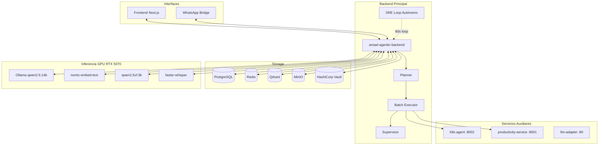

# Amael IA

> Plataforma de IA autónoma y multi-agente para asistencia conversacional y administración automatizada de infraestructura. Desplegada sobre Kubernetes (MicroK8s, single-node, GPU RTX 5070).

El backend principal es [`amael-agentic-backend`](../Amael-AgenticIA/) (en `Amael-AgenticIA/`). Este repositorio contiene los **servicios auxiliares**: frontend, bridges, adapters y agentes especializados.

---

## Servicios

| Servicio | Versión | Puerto | Descripción |
|---------|---------|--------|-------------|
| `amael-agentic-backend` | `1.10.24` | 8000 | **Backend principal** — LangGraph multi-agente, SRE autónomo, RAG, audio, visión |
| `frontend-next` | `1.3.9` | 3000 | Web UI activa (Next.js 14) |
| `frontend-ia` | `2.0.4` | 8501 | Web UI standby (Streamlit) |
| `k8s-agent` | `5.0.7` | 8002 | Agente K8s especializado + SRE loop (v1) |
| `productivity-service` | `1.3.0` | 8001 | Google Calendar / Gmail + Vault OAuth |
| `whatsapp-bridge` | `1.5.6` | 3000 | WhatsApp Web via Puppeteer (personal) |
| `whatsapp-personal` | `1.0.1` | 3001 | WhatsApp personal adicional |
| `llm-adapter` | `1.0.8` | 80 | Proxy OpenAI-compatible → Ollama |

---

## Ingress Routing (`amael-ia.richardx.dev`)

| Ruta | Destino |
|------|---------|
| `/api` | `amael-agentic-service:8000` |
| `/llm` | `llm-adapter:80` |
| `/` | `frontend-next:3000` |

---

## Arquitectura



---

## Capacidades del Backend Principal

### Pipeline LangGraph
```
planner → grouper → batch_executor → supervisor
    ↑                                    │
    └────── REPLAN (max 1 retry) ────────┘
```

### SRE Autónomo (6 capas de observación)
- **Pods/Nodos:** CrashLoop, OOM, ImagePullError, HighRestarts
- **Infraestructura K8s:** LoadBalancer sin IP, PVC Pending, Deployment degradado, Vault sellado
- **Métricas Prometheus:** CPU/Memoria/Error Rate
- **Predictivo:** Disk exhaustion, Memory leak, Error rate escalating
- **SLO:** Error budget burn rate

### Multimedia
- **Audio:** Transcripción de notas de voz WhatsApp con `faster-whisper` (modelo persistido en PVC)
- **Visión:** Análisis de imágenes con `qwen2.5vl:3b`

### WhatsApp — Comandos disponibles
| Comando | Descripción |
|---------|-------------|
| `/sre estado` | Estado de pods en todos los namespaces |
| `/sre grafana` | Lista de dashboards de Grafana |
| `/sre status` | Estado del loop SRE y circuit breaker |
| `/sre incidents` | Últimos incidentes |
| `/sre postmortems` | Últimos postmortems generados por LLM |
| `/sre slo` | Estado de SLO targets |
| `/sre maintenance on <min>` | Activar ventana de mantenimiento |
| `/sre maintenance off` | Desactivar mantenimiento |
| `/sre ayuda` | Lista de subcomandos SRE |
| `/plan` | Day planner |
| `/gastos` | Resumen de gastos |
| `/objetivos` | Objetivos activos |
| `/ayuda` | Lista de todos los comandos |

---

## Infraestructura compartida

Gestionada en `Amael-AgenticIA/k8s/infrastructure/`:

| Servicio | Versión | Namespace |
|---------|---------|-----------|
| PostgreSQL | 15 | `amael-ia` |
| Redis | 7 | `amael-ia` |
| Qdrant | latest | `amael-ia` |
| MinIO | latest | `amael-ia` |
| Ollama | latest | `amael-ia` |

---

## Observabilidad

9 dashboards en Grafana (namespace `observability`):
LLM, Pipeline, RAG, Infraestructura, Supervisor, Seguridad, Service Map, SRE Autónomo, Backend Overview.

Stack: Prometheus · Grafana · Tempo · OpenTelemetry Collector · NVIDIA DCGM Exporter

---

## Despliegue

```bash
# Build & Push
docker build -t registry.richardx.dev/<service>:<tag> ./<service>/
docker push registry.richardx.dev/<service>:<tag>

# Actualizar manifest y aplicar
kubectl set image deployment/<deploy> <container>=registry.richardx.dev/<service>:<tag> -n amael-ia
kubectl rollout status deployment/<deploy> -n amael-ia
```

---

## Seguridad

- **Auth:** Google OAuth + JWT · whitelist `K8S_ALLOWED_USERS_CSV`
- **Secretos:** HashiCorp Vault (Shamir 3-of-5, Kubernetes Auth Method)
- **Rate Limiting:** Redis (15 req/60s por usuario)
- **Sanitización:** Redacción automática de tokens `hvs.*`, JWTs, passwords
- **NetworkPolicy:** Egress/ingress controlado por namespace con Calico
