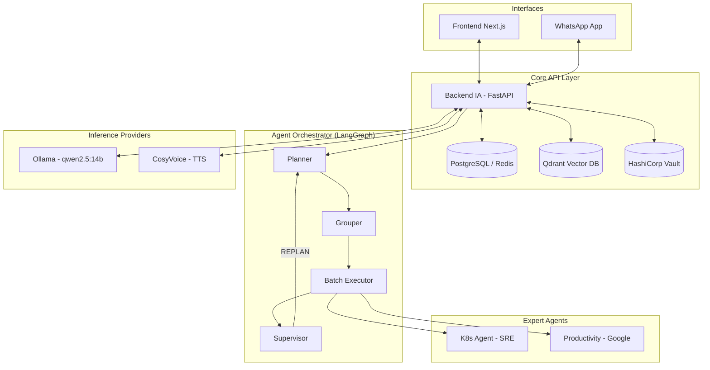

# Amael IA 🧠🤖

> **Amael IA** es una plataforma avanzada de Inteligencia Artificial Autónoma y Multi-Agente enfocada en la asistencia conversacional y la administración automatizada de infraestructuras (DevOps).

Desplegada completamente sobre Kubernetes, Amael IA utiliza una arquitectura de orquestación basada en **LangGraph** siguiendo el patrón **Planner → Grouper → Batch Executor → Supervisor**. Esto le permite descomponer tareas complejas, ejecutar herramientas en paralelo y auto-corregirse mediante una capa de retroalimentación de calidad.

---

## ✨ Características Principales

*   💬 **Interfaz Conversacional:** Acceso mediante **Next.js 14** (principal) y **Streamlit** (standby), con conectividad nativa vía **WhatsApp** (`whatsapp-bridge` v1.3.0).
*   🔒 **Seguridad & Hardening (P4):** Autenticación **Google OAuth**, encriptado con **Vault**, validación de prompts anti-inyección, rate limiting mediante Redis y sanitización de outputs.
*   🧠 **Memoria & Objetivos (v2.15.0):** Perfiles persistentes, extracción automática de hechos (facts) y seguimiento de objetivos con progreso.
*   🛠️ **DevOps Autónomo (K8s SRE Agent):** Administra el clúster en tiempo real. Lista pods, revisa logs, consulta PromQL/Grafana y ejecuta acciones correctivas.
*   📅 **Productividad Integrada:** Automatización de agenda mediante integración con **Google Calendar** y **Gmail API** (`productivity-service`).
*   📊 **Observabilidad Full-Stack (P6/P7):** Monitoreo con **Prometheus, Grafana y Tempo**. Incluye un **Service Map** en tiempo real y 7 dashboards especializados.

---

## 🏗️ Arquitectura de Microservicios

Amael IA orquestado por **Kubernetes (MicroK8s)** con imágenes en registro privado `registry.richardx.dev`.

### 🧠 Capa de Inferencia (Single NVIDIA RTX 5070)
*   **LLM Principal:** `qwen2.5:14b` (alojado en Ollama).
*   **Embeddings:** `nomic-embed-text` (alojado en Ollama) - 768 dim.
*   **Voz (TTS):** `CosyVoice-300M` (alojado en `cosyvoice-service`).

### Componentes Core:

| Servicio | Versión | Descripción |
|---------|---------|-------------|
| `backend-ia` | `2.16.0` | Orquestador LangGraph, Memory Agent, Facts extraction. |
| `k8s-agent` | `1.6.0` | SRE Expert, automatización K8s + Vault. |
| `productivity-service` | `1.2.0` | Integración Google Workspace + Vault integration. |
| `frontend-next` | `1.0.4` | Web UI principal (Next.js 14, activo en `/`). |
| `frontend-ia` | `2.0.4` | Streamlit UI (standby), system-token theming. |
| `whatsapp-bridge` | `1.3.0` | Puppeteer bridge con historial y comandos rápidos. |
| `llm-adapter` | `1.0.0` | Proxy OpenAI-compatible hacia Ollama. |

---

### Ingress Routing (`amael-ia.richardx.dev`)

- `/api` → `backend-ia:8000`
- `/llm` → `llm-adapter:80`
- `/tts` → `cosyvoice-service:8000`
- `/` → `frontend-next:3000`

---

### Diagrama de Flujo



---

## 📊 Observabilidad & Métricas

Amael incluye un stack de observabilidad profundo para telemetría y seguridad:

*   **Dashboards:** 7 paneles en Grafana (LLM, Pipeline, RAG, Infra, Supervisor, Seguridad, Service Map).
*   **Tracing:** Implementación de OpenTelemetry en todos los microservicios con Tempo.
*   **Service Map:** Visualización en tiempo real de la topología de llamadas inter-servicios.

---

## 🚀 Despliegue (Manual CI/CD)

```bash
# 1. Build & Push
docker build -t registry.richardx.dev/<service>:<tag> ./<service>/
docker push registry.richardx.dev/<service>:<tag>

# 2. Deploy
kubectl apply -f k8s/<manifest>.yaml -n amael-ia
kubectl rollout status deployment/<service> -n amael-ia
```

## 🔐 Seguridad y Privacidad
*   **Vault Integration:** Tokens de Google OAuth se almacenan cifrados por usuario usando Kubernetes Auth Method.
*   **RBAC estricto:** El agente de K8s está restringido al namespace `amael-ia`.
*   **Sanitización:** Redacción automática de tokens `hvs.*`, JWTs y passwords.
*   **Rate Limiting:** Control de inundación mediante Redis (15 req/60s).
