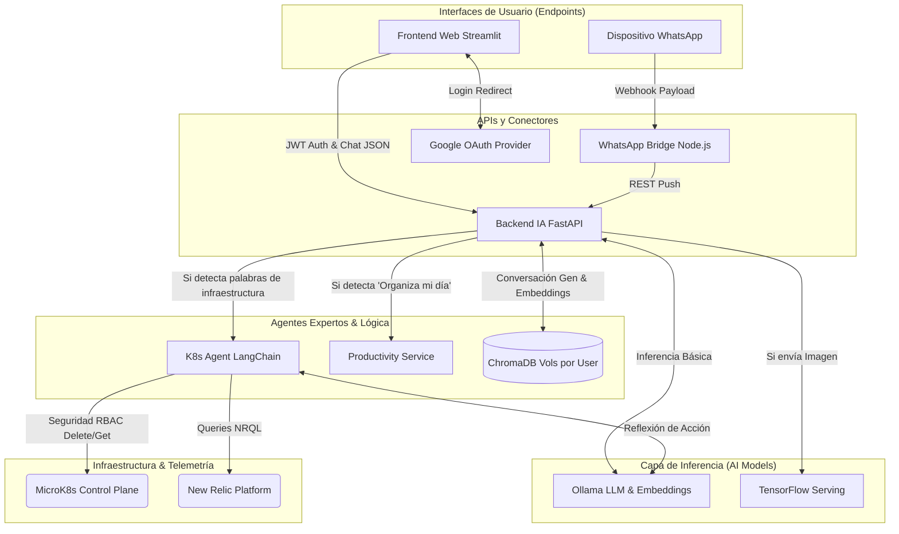

# Amael IA 🧠🤖

> **Amael IA** es una plataforma avanzada de Inteligencia Artificial Autónoma y Multi-Agente enfocada en la asistencia conversacional y la administración automatizada de infraestructuras (DevOps).

Desplegada completamente sobre Kubernetes, Amael IA no solo responde a preguntas generales integrando capacidades **RAG (Retrieval-Augmented Generation)** aisladas por usuario, sino que actúa activamente sobre tu entorno, organizando tareas y administrando clústeres reales con herramientas expertas.

---

## ✨ Características Principales

*   💬 **Interfaz Conversacional:** Acceso mediante un frontend web moderno en **Streamlit** y conectividad nativa vía **WhatsApp** (`whatsapp-bridge`).
*   🔒 **Autenticación y Seguridad:** Soporte para **Google OAuth**, encriptado con JWT y persistencia segura de sesiones por perfil.
*   🧠 **RAG Multiusuario:** Ingesta de PDFs y TXTs con vectorización en **ChromaDB**. Cada usuario tiene su propio espacio de memoria y contexto aislado en un volumen persistente.
*   🛠️ **DevOps Autónomo (K8s Agent):** Amael administra tu clúster en tiempo real. Puede listar pods, revisar logs, consultar el consumo de recursos (`New Relic`) e incluso **eliminar pods anómalos** directamente desde el chat usando `Langchain agents`.
*   📅 **Productividad Integrada:** Analiza correos y requerimientos para programar tareas directamente en tu calendario mediante su módulo especializado `productivity-service`.
*   👁️ **Visión Artificial:** Interacción con modelos de Deep Learning alojados en **TensorFlow Serving** para análisis y clasificación de imágenes subidas en el chat.

---

## 🏗️ Arquitectura de Microservicios

Amael IA sigue un enfoque de diseño modular nativo de la nube. Cada función especializada recae en un microservicio orquestado por Kubernetes (MicroK8s).

### Componentes Clave:
1.  **`frontend-ia`**: Interfaz de usuario rica desarrollada en Python/Streamlit. Maneja el estado de la sesión, la subida de archivos multimedias y documentos RAG.
2.  **`backend-ia`**: El "Cerebro Central" (FastAPI). Gestiona la autenticación, el historial conversacional (JSON), el proxy hacia modelos LLM (`ollama`) y rutea de forma inteligente (basado en intenciones semánticas) las peticiones operativas hacia otros micro-agentes especializados.
3.  **`k8s-agent`**: Agente experto (`ZERO_SHOT_REACT`) con comandos e integraciones embebidas de la API de Kubernetes. Protegido rigurosamente mediante roles (RBAC). Interpreta lenguaje natural para realizar operaciones seguras (`kubectl delete`, `get`, `logs`) e interactúa vía GraphQL con New Relic para dar resúmenes sobre CPU y RAM.
4.  **`productivity-service`**: Microservicio enfocado en el parseo y organización de calendarios basados en intenciones temporales.
5.  **`whatsapp-bridge`**: Backend Express.js que interactúa con la API Cloud de Meta, permitiendo iniciar sesíón y chatear con Amael directamente desde WhatsApp manteniendo el mismo historial.
6.  **`ollama-service` & `tf-serving`**: Capas base de inferencia. Ollama procesa la lógica generativa y los embeddings, mientras que TensorFlow Serving hostea ImageNet/MobileNet para la visión artificial.

### Diagrama Arquitectónico



---

## 🚀 Despliegue Rápido y Flujo de Desarrollo

Todo el despliegue está contenerizado usando **Docker** y alojado en un `registry` local.
Los manifiestos YAML de Kubernetes se encuentran dentro de la carpeta `k8s/` y describen todos los recursos necesarios (ConfigMaps, Secrets, PVCs, Deployments y Services) para configurar el espacio de trabajo `amael-ia` de cero.

### Guía Rápida:
1. Asegurarte que el registro de imágenes esté corriendo y tus DNS (`registry.richardx.dev`) estén propagados a los nodos físicos de MicroK8s.
2. Contar con un `.env` que contenga las credenciales (`JWT_SECRET`, tokens OAuth de Google y WhatsApp, y API Keys de New Relic).
3. Construir la imagen de un microservicio específico y luego aplicarlo en el clúster usando la CLI o herramientas GitOps. Ejemplo:
```bash
cd k8s-agent
docker build -t registry.richardx.dev/k8s-agent:latest .
docker push registry.richardx.dev/k8s-agent:latest
kubectl apply -f ../k8s/19.-k8s-agent-deployment.yaml
kubectl rollout restart deployment k8s-agent-deployment -n amael-ia
```

## 🔐 Seguridad y Limitaciones
* Todas las acciones sobre el clúster están delimitadas con el namespace `-n amael-ia` para aislar el alcance del IA.
* El RBAC de k8s provee permisos exactos basándose en el principio de mínimo privilegio (`get, list, delete`).
* Queda **restringido** para el K8s Agent buscar o listar credenciales, APIs, Secrets o Tokens dentro de Kubernetes para prevenir brechas de seguridad informando todo por chat.
