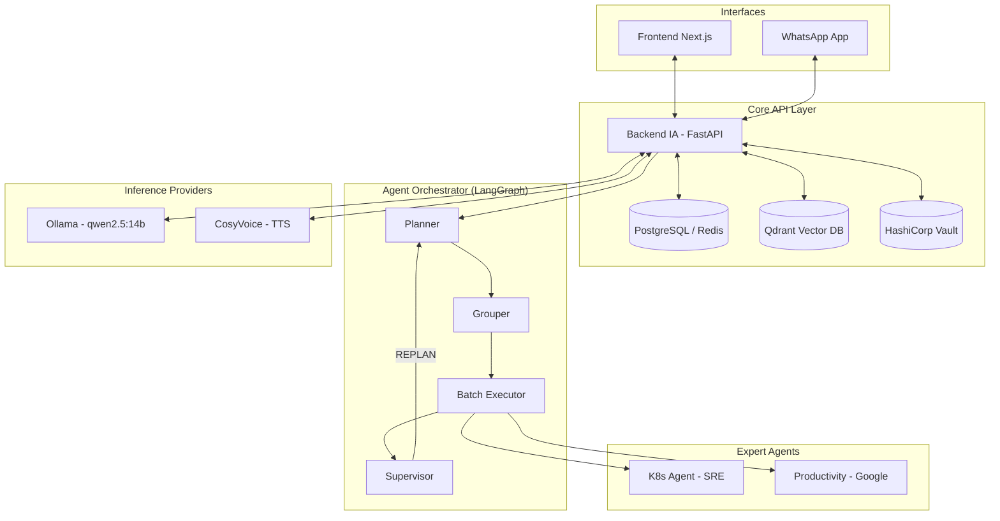

# Amael IA 🧠🤖

> **Amael IA** es una plataforma avanzada de Inteligencia Artificial Autónoma y Multi-Agente enfocada en la asistencia conversacional y la administración automatizada de infraestructuras (DevOps).

Desplegada completamente sobre Kubernetes, Amael IA utiliza una arquitectura de orquestación basada en **LangGraph** siguiendo el patrón **Planner → Grouper → Batch Executor → Supervisor**. Esto le permite descomponer tareas complejas, ejecutar herramientas en paralelo y auto-corregirse mediante una capa de retroalimentación de calidad.

---

## ✨ Características Principales

*   💬 **Interfaz Conversacional:** Acceso mediante **Next.js 14** (principal) y **Streamlit** (standby), con conectividad nativa vía **WhatsApp** (`whatsapp-bridge` v1.3.0).
*   🔒 **Seguridad & Hardening (P4):** Autenticación **Google OAuth**, encriptado con **Vault**, validación de prompts anti-inyección, rate limiting mediante Redis y sanitización de outputs.
*   🧠 **Memoria & Objetivos (v2.15.0):** Perfiles persistentes, extracción automática de hechos (facts) y seguimiento de objetivos con progreso.
*   🛠️ **DevOps Autónomo (K8s SRE Agent):** Administra el clúster en tiempo real. Lista pods, revisa logs, consulta PromQL/Grafana y ejecuta acciones correctivas.
*   📅 **Productividad Integrada:** Automatización de agenda mediante integración con **Google Calendar** y **Gmail API** (`productivity-service`).
*   📊 **Observabilidad Full-Stack (P6/P7):** Monitoreo con **Prometheus, Grafana y Tempo**. Incluye un **Service Map** en tiempo real y 7 dashboards especializados.
*   🔄 **Resiliencia (P8):** Conectividad robusta a bases de datos con reintentos automáticos y carga diferida (Lazy Initialization) para evitar fallos por DNS temporales.


---

## 🏗️ Arquitectura de Microservicios

Amael IA orquestado por **Kubernetes (MicroK8s)** con imágenes en registro privado `registry.richardx.dev`.

### 🧠 Capa de Inferencia (Single NVIDIA RTX 5070)
*   **LLM Principal:** `qwen2.5:14b` (alojado en Ollama).
*   **Embeddings:** `nomic-embed-text` (alojado en Ollama) - 768 dim.
*   **Voz (TTS):** `CosyVoice-300M` (alojado en `cosyvoice-service`).

### Componentes Core:

| Servicio | Versión | Descripción |
|---------|---------|-------------|
| `backend-ia` | `2.20.1` | Orquestador LangGraph, Memory Agent, Facts extraction, Robust DB Init. |
| `k8s-agent` | `1.6.0` | SRE Expert, automatización K8s + Vault. |
| `productivity-service` | `1.2.0` | Integración Google Workspace + Vault integration. |
| `frontend-next` | `1.0.4` | Web UI principal (Next.js 14, activo en `/`). |
| `frontend-ia` | `2.0.4` | Streamlit UI (standby), system-token theming. |
| `whatsapp-bridge` | `1.3.0` | Puppeteer bridge con historial y comandos rápidos. |
| `llm-adapter` | `1.0.0` | Proxy OpenAI-compatible hacia Ollama. |

---

### Ingress Routing (`amael-ia.richardx.dev`)

- `/api` → `backend-ia:8000`
- `/llm` → `llm-adapter:80`
- `/tts` → `cosyvoice-service:8000`
- `/` → `frontend-next:3000`

---

### Diagrama de Flujo



---

## 📊 Observabilidad & Métricas

Amael incluye un stack de observabilidad profundo para telemetría y seguridad:

*   **Dashboards:** 7 paneles en Grafana (LLM, Pipeline, RAG, Infra, Supervisor, Seguridad, Service Map).
*   **Tracing:** Implementación de OpenTelemetry en todos los microservicios con Tempo.
*   **Service Map:** Visualización en tiempo real de la topología de llamadas inter-servicios.

---

## 🛠️ Detalle de Servicios y Comunicación

Amael IA es un sistema distribuido donde cada microservicio tiene una responsabilidad única y se comunica mediante protocolos estándar (REST/gRPC/S3).

### 1. `backend-ia` (El Orquestador)
*   **Función:** Gestiona el grafo de agentes (**LangGraph**), maneja la memoria persistente del usuario y coordina la ejecución de herramientas.
*   **Comunicación:**
    *   **Expertos:** Llama a `k8s-agent` y `productivity-service` vía REST usando `INTERNAL_API_SECRET`.
    *   **Inferencia:** Conecta con `ollama-service` (puerto 11434) para razonamiento y `cosyvoice-service` (puerto 8000) para TTS.
    *   **Bases de Datos:** PostgreSQL (historia), Redis (rate limit), Qdrant (RAG).
*   **Endpoints Clave:** `/api/chat/stream`, `/api/memory/profile`, `/api/conversations`.

### 2. `k8s-agent` (El Experto SRE)
*   **Función:** Agente especializado en la administración del clúster y seguridad de secretos.
*   **Comunicación:**
    *   **Clúster:** Consulta la API de Kubernetes para gestionar recursos.
    *   **Métricas:** Realiza consultas PromQL a **Prometheus** y extrae dashboards de **Grafana**.
    *   **Secretos:** Interactúa con HashiCorp Vault para troubleshooting de políticas.
*   **Configuración:** Requiere `INTERNAL_API_SECRET` para autorizar peticiones del backend.

### 3. `productivity-service` (Integración Workspace)
*   **Función:** Gestiona calendarios (Google Calendar) y correos (Gmail).
*   **Comunicación:**
    *   **Vault:** Utiliza el método **Kubernetes Auth** para recuperar tokens de Google OAuth cifrados desde `secret/data/amael/google-tokens/*`.
    *   **Timezone:** Sincronizado con `America/Mexico_City` para gestión de agendas.

### 4. `whatsapp-bridge` (El Puente Móvil)
*   **Función:** Expone la IA en WhatsApp usando Puppeteer y persistencia de sesión.
*   **Comunicación:** Actúa como cliente proactivo del `backend-ia`, manteniendo el historial de conversación por número telefónico.

---

## ⚙️ Reglas de Configuración y Seguridad

### Patrones de Autenticación
*   **Interna:** Comunicación entre microservicios protegida por `INTERNAL_API_SECRET` (incluida en el header `Authorization: Bearer`).
*   **Vault K8s Auth:** Los servicios (`productivity-service`) no almacenan credenciales de Vault; presentan su **ServiceAccount Token** a Vault, que lo valida contra la API de Kubernetes.

### Variables de Entorno Críticas
*   `VAULT_ADDR`: `http://vault.vault.svc.cluster.local:8200`
*   `K8S_ALLOWED_USERS_CSV`: Lista blanca de emails y números telefónicos autorizados para interactuar con la IA.
*   `RATE_LIMIT_MAX`: Máximo de 15 peticiones por ventana de 60 segundos (Redis).

### Almacenamiento y RAG
*   **VectorStore:** Todos los embeddings generados por `nomic-embed-text` se almacenan en la colección `amael_knowledge` de Qdrant.
*   **Aislamiento:** La búsqueda semántica está filtrada por `user_id` en los metadatos de los puntos en Qdrant.

---

## 📊 Observabilidad Avanzada

El sistema implementa el patrón **Observer Sidecar**:
*   **Tracing:** Cada mensaje genera un `TraceId` que viaja desde el frontend hasta el agente de K8s, visualizable en el **Service Map** de Grafana/Tempo.
*   **Alerting:** Métricas de seguridad (`amael_security_input_blocked_total`) disparan alertas cuando se detectan intentos de inyección de prompt.

### 5. `llm-adapter` (Proxy OpenAI Compatible)
*   **Función:** Actúa como puente entre cualquier cliente OpenAI-compatible (LangChain, Cursor, n8n) y el motor local Ollama.
*   **Seguridad:** Protegido mediante un `ADAPTER_API_KEY` almacenado en un `Secret` de Kubernetes.
*   **Comunicación:**
    *   **Inbound:** Acepta peticiones REST en formato OpenAI `/v1`.
    *   **Outbound:** Traduce y envía a `ollama-service:11434`.

---

## 🚀 Consumo del LLM-Adapter (OpenAI Standard)

El servicio está expuesto a través de Kong Gateway y permite el uso de cualquier SDK estándar.

### Configuración del Cliente
- **Base URL:** `https://apiproxy.********.dev/llm-adapter/api/v1`
- **API Key:** `Bearer YOUR_SECURE_TOKEN`
- **Modelos Disponibles:** `glm4`, `llama3`, `qwen2.5:14b`.

### Ejemplo de Consulta (cURL)
```bash
curl -i https://apiproxy.********.dev/llm-adapter/api/v1/chat/completions \
  -H "Authorization: Bearer YOUR_SECURE_TOKEN" \
  -H "Content-Type: application/json" \
  -d '{
    "model": "glm4",
    "messages": [{"role": "user", "content": "Hola mundo"}],
    "stream": true
  }'
```

---

## 🚀 Despliegue (Manual CI/CD)

```bash
# 1. Build & Push
docker build -t registry.richardx.dev/<service>:<tag> ./<service>/
docker push registry.richardx.dev/<service>:<tag>

# 2. Deploy
kubectl apply -f k8s/<manifest>.yaml -n amael-ia
kubectl rollout status deployment/<service> -n amael-ia
```

## 🔐 Seguridad y Privacidad
*   **Vault Integration:** Tokens de Google OAuth se almacenan cifrados por usuario usando Kubernetes Auth Method.
*   **RBAC estricto:** El agente de K8s está restringido al namespace `amael-ia`.
*   **Sanitización:** Redacción automática de tokens `hvs.*`, JWTs y passwords.
*   **Rate Limiting:** Control de inundación mediante Redis (15 req/60s).
